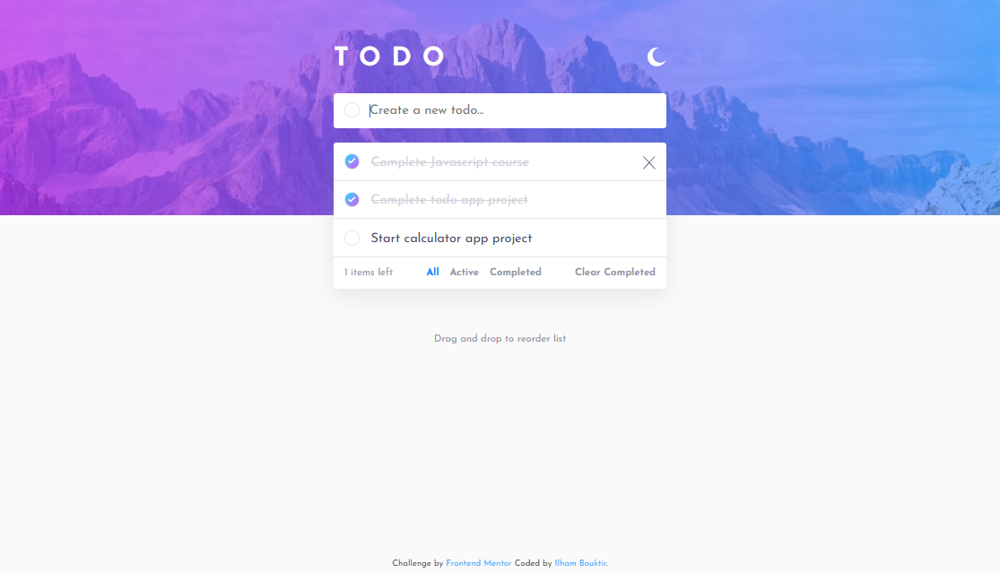
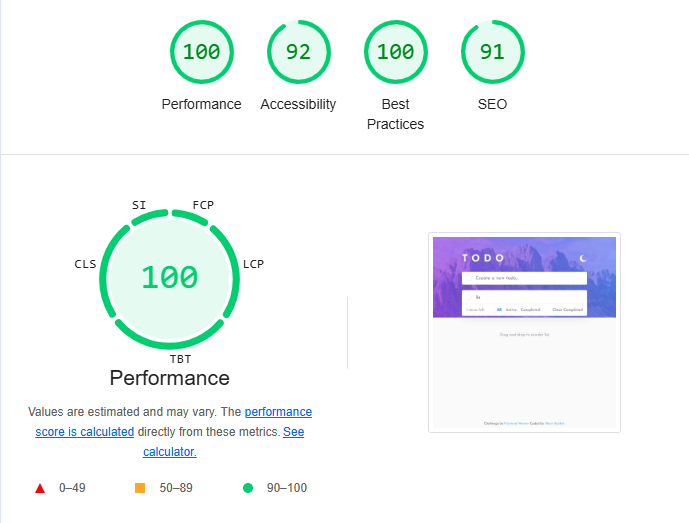

# Frontend Mentor - Todo app solution

This is a solution to the [Todo app challenge on Frontend Mentor](https://www.frontendmentor.io/challenges/todo-app-Su1_KokOW). Frontend Mentor challenges help improve coding skills by building realistic projects. 

## Table of contents

- [Overview](#overview)
  - [The challenge](#the-challenge)
  - [Screenshot](#screenshot)
  - [Links](#links)
- [My process](#my-process)
  - [Built with](#built-with)
  - [What I learned](#what-i-learned)
  - [Continued development](#continued-development)
  - [Useful resources](#useful-resources)
- [Author](#author)
- [Acknowledgments](#acknowledgments)

## Overview

### The challenge

Users should be able to:

- View the optimal layout for the app depending on their device's screen size
- See hover states for all interactive elements on the page
- Add new todos to the list
- Mark todos as complete
- Delete todos from the list
- Filter by all/active/complete todos
- Clear all completed todos
- Toggle light and dark mode
- **Bonus**: Drag and drop to reorder items on the list

### Screenshot



**Performance** <br>


### Links

- Solution URL: [Solution]()
- Live Site URL: [Live site](https://ilham-bouk.github.io/Todo_app/)

## My process

### Built with

- Semantic HTML5 markup
- CSS custom properties
- Flexbox
- CSS Grid
- JavaScript
- Desktop-first workflow 

### What I learned

This challenge provided valuable practice for my coding skills, particularly in the .

```js
  if (e.target.alt === "delete") {
    deleteTask(e.target.parentElement.getAttribute("data-id"))
    e.target.parentElement.remove();
    updateLeftItems();
  }
```

```js
filterSpans.forEach(span => {
  span.addEventListener("click", () => {    
    filterSpans.forEach(s => s.classList.remove("active"));
    span.classList.add("active");

    const filterType = span.textContent.toLowerCase();
    let filteredTasks = tasksArray;
    if (filterType == 'completed') {
      filteredTasks = tasksArray.filter(task => task.completed);
    } else if (filterType == 'active') {
      filteredTasks = tasksArray.filter(task => !task.completed);
    }
    addToPage(filteredTasks);
  });
});
```

### Useful resources

- [Todo List](https://github.com/ilham-bouk/ToDo_List) :
- [MDN Web Docs](https://developer.mozilla.org/en-US/docs/Web/CSS/)

## Author

- Frontend Mentor - [@ilham-bouk](https://www.frontendmentor.io/profile/ilham-bouk)
- LinkedIn - [Ilham Bouktir](https://www.linkedin.com/in/ilham-bouktir-0b266b31b)

## Acknowledgments

A big thank you to anyone providing feedback on [my solution](). It definitely helps to find new ways to code and find easier solutions!

**Happy coding!** ☺️🚀 
